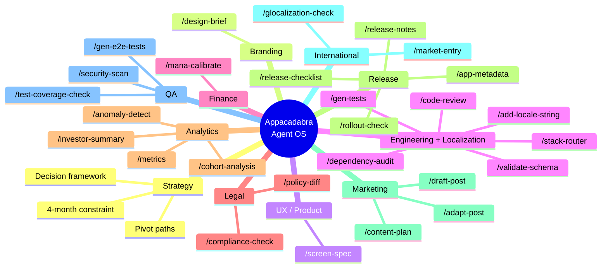
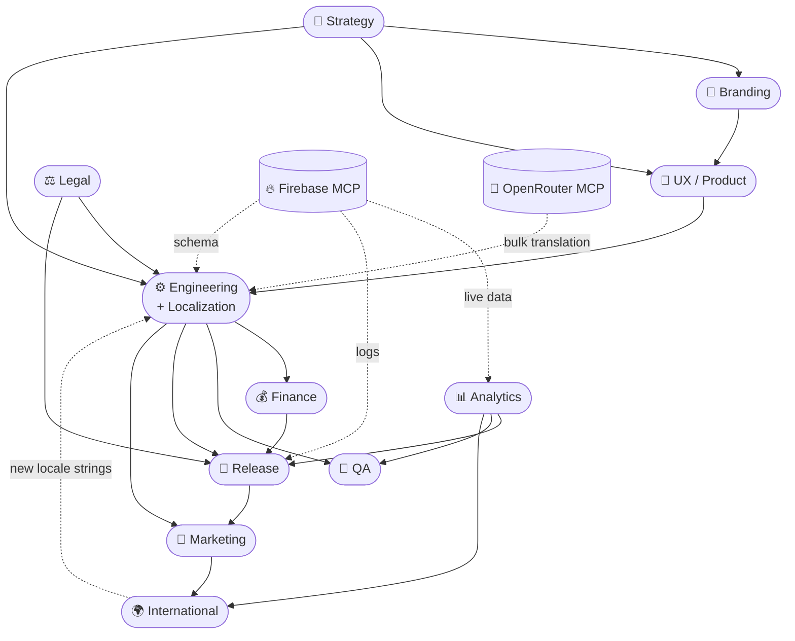

# The Appacadabra Chronicles — Conclusion

---

## The Architecture of an AI-Native Company

Four months of nights and weekends — while employed full-time. Eleven departments. One founder. One hundred decisions I couldn't have made without AI. Dozens of decisions I couldn't have fully validated with it.

This is not a satisfying place to end. It doesn't resolve cleanly into a productivity metric or a startup playbook. But it's the honest account — and in a space where most AI content tends toward either uncritical enthusiasm or reflexive skepticism, honesty might be the most useful thing this series can offer.

Before we get to what was proved and what wasn't, let's look at what was actually built.

---

### The Agent Constellation

Eleven agents. Each configured specifically for Appacadabra — not generic assistants, but agents that know this company's stack, voice, constraints, and decisions. Together they cover every department a real company requires.

One design decision worth noting explicitly: **Engineering and Localization share a single agent**, because they share a single blog article (Part 4). The 1 article = 1 agent rule was the organizing principle — it keeps the architecture legible and prevents the agent layer from fragmenting into more pieces than the company's departments actually require.

| Agent | Department | What It Knows |
|-------|------------|----------------|
| **Strategy Agent** | Strategy | The 4-month constraint model, the 4-question decision framework, the product positioning that survived 12 stress-test rounds |
| **Branding Agent** | Branding | The full visual identity, `lib/theme.ts` palette, WCAG AA requirements, Vertex AI prompt patterns for on-brand assets |
| **UX Agent** | UX/Product | Expo Router navigation structure, design system tokens, Zustand/SQLite/Firebase data requirements per screen |
| **Engineering Agent** | Engineering & Localization | Full polyglot stack (React Native, Kotlin, Firebase Functions, TypeScript), architecture invariants, mana guard pattern, 17-locale i18n system, back-translation protocol |
| **Finance Agent** | Finance | Mana pricing constants, API cost structure, unit economics framework, margin thresholds per operation |
| **Legal Agent** | Legal | Privacy architecture (local-first, Gemini API as only external data flow), GDPR/LGPD/COPPA compliance surface, policy documents |
| **Analytics Agent** | Data Analytics | Firestore schema, Firebase MCP query patterns, subcollection constraints, interpretation framework for product metrics |
| **Release Agent** | Release Management | Play Store policy landscape, staged rollout thresholds, 17-locale release notes, Firebase log-based go/no-go criteria |
| **Marketing Agent** | Marketing | Appacadabra brand voice, X thread format vs LinkedIn narrative format, content calendar logic, platform adaptation rules |
| **International Agent** | International Strategy | 10 active markets in priority order, cultural adaptation dimensions, localization constraints per market |
| **QA Agent** | Quality Assurance | Maestro YAML conventions, testing pyramid structure, security surface (WebView XSS, bridge validation, Firebase rules) |

---

### The Command Surface

Twenty-seven executable commands — the institutional knowledge of the company encoded as actions that can be taken repeatedly, consistently, without rebuilding context from scratch each time.

| Command | Agent | What It Does |
|---------|-------|--------------|
| `/design-brief` | Branding | Produces a structured visual brief + Vertex AI generation prompt for any asset |
| `/screen-spec` | UX | Generates a full screen specification + browser-testable HTML scaffold for any user story |
| `/code-review` | Engineering | Reviews code against architecture invariants, mana guard pattern, and code quality rules |
| `/gen-tests` | Engineering | Generates Jest unit test scaffolding, always including the mana-not-charged-on-failure path |
| `/validate-schema` | Engineering | Validates Firestore document shapes and SQLite schema against TypeScript type definitions |
| `/dependency-audit` | Engineering | Audits a new npm package for New Architecture compatibility, bundle size, and conflicts |
| `/stack-router` | Engineering | Routes tasks to the right model — Claude (TypeScript), Gemini (Android), or OpenRouter (bulk translation) |
| `/add-locale-string` | Engineering | Adds a new i18n key across all 17 locales via OpenRouter (cheap multilingual model), with back-translation verification for JA/AR/HI/KO |
| `/mana-calibrate` | Finance | Recalculates mana costs for all operations based on current API pricing, flags margins below 30% |
| `/compliance-check` | Legal | Audits a new feature against GDPR, LGPD, COPPA, and Google Play policies |
| `/policy-diff` | Legal | Analyzes a policy change for re-consent requirements and Data Safety form impact |
| `/metrics` | Analytics | Queries Firestore to produce a structured product metrics report for any period |
| `/anomaly-detect` | Analytics | Detects deviations in failure rates and mana consumption against a rolling baseline |
| `/cohort-analysis` | Analytics | Segments users by behavior and analyzes engagement, consumption, and conversion per cohort |
| `/investor-summary` | Analytics | Produces an investor-facing narrative from current Firestore metrics |
| `/release-notes` | Release | Generates Play Store release notes across all 17 locales, under 500 characters each |
| `/release-checklist` | Release | Pre-submission checklist: version parity, permissions, store listing, staged rollout config |
| `/app-metadata` | Release | Generates Play Store listing copy calibrated for the app's keyword clusters |
| `/rollout-check` | Release | Queries Firebase logs and job failure rates to produce a go/no-go rollout verdict |
| `/draft-post` | Marketing | Drafts a complete post for X (thread) or LinkedIn (narrative) in Appacadabra's voice |
| `/content-plan` | Marketing | Builds a content calendar mapping product milestones to content formats and cadences |
| `/adapt-post` | Marketing | Adapts existing content for a different platform while preserving voice and core insight |
| `/market-entry` | International | Market entry readiness assessment: regulatory, distribution, cultural, competitive |
| `/glocalization-check` | International | Cultural compatibility audit across all 10 active markets for any new feature |
| `/test-coverage-check` | QA | Identifies user flows without Maestro coverage and generates scaffolding for missing tests |
| `/gen-e2e-tests` | QA | Generates a complete Maestro YAML flow for any user journey |
| `/security-scan` | QA | Audits WebView security, Firebase rules, secret management, input validation, and permissions |

---

### The Connections Between Agents

The agents don't operate in isolation. The architecture that makes this a company operating system — rather than eleven disconnected tools — is the network of dependencies and handoffs between them.

The **Engineering Agent** is the hub. Its output feeds directly into the **QA Agent** (every new function generates tests) and the **Finance Agent** (every new AI operation requires mana calibration). It receives constraints from the **Strategy Agent** (what to build), the **UX Agent** (how screens should behave), and the **Legal Agent** (what data flows are permissible). It also owns localization — every new UI string passes through `/add-locale-string` before shipping.

The **Release Agent** sits downstream of everything. It consumes Engineering output (code), the Engineering Agent's localization work (release notes in 17 languages), Analytics data (rollout health signals), and Finance output (mana pricing that must be accurate before shipping). A release decision is, implicitly, a validation that every upstream agent did its job.

The **Marketing Agent** activates on product events. When Engineering ships a feature, Marketing drafts the thread. When Release publishes a new version, Marketing drafts the announcement. When Analytics surfaces a milestone, Marketing turns it into a story. The content calendar (`/content-plan`) is the scheduling layer that ties Marketing output to the product's actual rhythm.

The **Analytics Agent** feeds back upstream. Its anomaly detection can trigger the QA Agent's regression suite. Its cohort data informs the International Agent's market prioritization. Its investor summaries distill the work of every other department into the signal that determines whether the company continues to exist.

The **International Agent** receives strategic intelligence from Marketing (which markets are generating organic engagement) and feeds requirements back to Engineering (new locale strings, RTL layout considerations) and Release (market-specific App Store metadata).

This is not a flat list of tools. It is a directed graph where decisions flow downstream and feedback flows upstream — the same topology as a functional company org chart.

---

### The MCP Layer

Two external MCPs connect the agent constellation to live systems:

**Firebase MCP** — used by Engineering, Finance, Analytics, and Release agents. Provides direct access to Firestore (`jobs`, `users` collections), Cloud Function logs (`processSpellJob`), and project configuration. The Analytics and Release agents could not operate without it — their core function is interpreting live production data, not static analysis.

**OpenRouter MCP** (`@mcpservers/openrouterai`) — used by the Engineering agent for bulk translation jobs routed through `/stack-router`. Configured with `google/gemma-4-26b-a4b-it` as primary and `openai/gpt-oss-120b` as fallback. The cost justification is direct: running translation inferences through an open model costs nothing; running them through Claude does not.

---

### What This Experiment Proved

**AI can compress the time to build a company by an order of magnitude.**

The departments that historically required specialized human teams — Branding, UX, Legal, Finance, Analytics, Release, Marketing, International Strategy — were each stood up by one founder in a fraction of the traditional time. Not at reduced quality across the board. At reduced quality in specific areas that have been identified and accepted, and at equivalent or superior quality in areas where AI's strengths aligned with the domain.

The **agent + skill + MCP** architecture — what the AI engineering community is beginning to call **harness engineering** — is the key insight that most AI productivity writing misses. It's not about using AI to answer questions. It's about building agents that understand *your company* — your stack, your voice, your constraints, your decisions — and can act within that context automatically. Each department wasn't just staffed by AI. It was *encoded* into a living system that can continue operating the next time the same type of work is needed. The difference between a prompt and an MCP is the difference between a task and a process.

### What It Didn't Prove

**AI does not eliminate the need for human judgment. It accelerates you into it.**

Every department required acting as a senior leader in a discipline not formally studied — making strategic decisions, evaluating expert output, accepting calculated risk in areas that couldn't be fully validated. AI gave better information, faster. It didn't make the decisions.

The validation gap is real. For departments where I had expertise — engineering, product architecture, technical decision-making — AI was a force multiplier. For departments where I lacked expertise — legal nuance, branding taste at the pixel level, cross-cultural consumer psychology — AI was a capable but imperfect partner, and the decisions were made with incomplete certainty. That is not a comfortable position. It is the only honest one available.

The DevOps wall in Part 7 is the clearest evidence of this limit: Android environment debugging, with its combinatorial explosion of interacting variables, remains a domain where human intuition built from years of shipping is still irreplaceable. AI explained errors once they were found. It could not find them.

### What Comes Next

The infrastructure built over these four months is not a four-month project. It is the beginning of a company's operating system.

As Appacadabra grows — as new features are built, new markets entered, new AI models integrated, new compliance requirements emerge — the agents evolve with it. Each new task that passes through an agent, gets captured as a skill, and gets formalized as an MCP, makes the system slightly more capable and slightly more specifically *Appacadabra*.

The departments not yet built — Customer Support, Sales, PR, Investor Relations — will be built the same way. Starting with the first manual interaction. Encoding it as a skill. Formalizing it as a protocol. Each one will arrive with the same foundation: an agent that already knows the company, because the company's knowledge is already in the system.

One trap worth naming explicitly before closing: **the architecture is seductive**. Building agents, encoding skills, designing harnesses — this work is satisfying in ways that talking to users, handling a support queue, or grinding through a growth plateau is not. It is entirely possible to spend weeks building the infrastructure to run a company and quietly neglect the company itself. Like every powerful tool in the history of technology, the harness works best when you remember what it's harnessing *for*. The goal is to free your attention for the work that actually moves the business — not to let agent-building become a productive-feeling substitute for it. Build the HR agent when you have HR problems. Build the Sales agent when you have a sales motion worth automating. The sequence matters: business need first, harness second.

This is the new model of the software company. Not a team of humans with AI assistants. Not autonomous AI with a human supervisor. A human CEO operating a constellation of specialized AI agents, each one deeply configured to serve the company's specific context, each one extending the founder's capability into domains they couldn't previously reach.

It is more difficult than it sounds. It is more possible than most people believe.

And it is just beginning.

---

*The Appacadabra Chronicles is a 13-part series (Preface + Parts 1–11 + Conclusion) documenting the AI-driven construction of a full software company. The series covers Strategy, Branding, UX/Product, Engineering & Localization, Finance, Legal, Data Analytics & DevOps, Release Management, Marketing, International Strategy, and Quality Assurance.*
