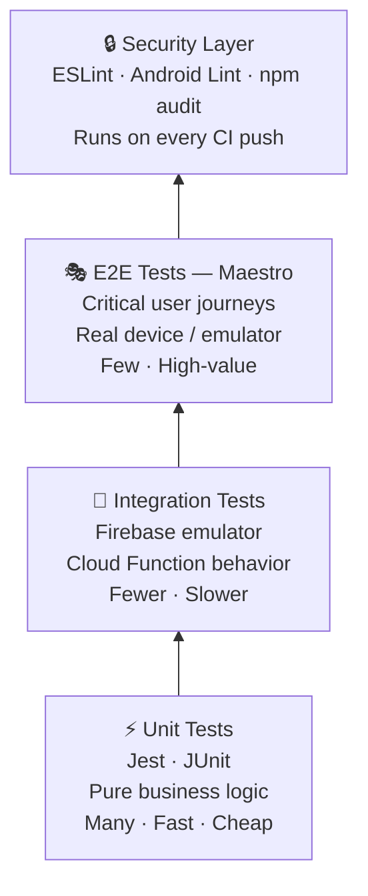

# The Appacadabra Chronicles — Expanded Blog Post (Part 10)

---

## Part 11: The Quality Assurance Department — Taming the Machine

Ten departments. A product live in production, generating apps for real users, processing real payments, distributed across multiple markets with a running content engine telling the world it existed. Everything had been built. Almost nothing had been systematically validated at scale. The QA Department was the last to be assembled — and the one that had to retroactively prove that the other ten had done their jobs.

*"Testing shows the presence, not the absence, of bugs."*
— Edsger W. Dijkstra, 1969

Dijkstra wrote that sentence in an era when software was tested by hand, by the people who had written it, hoping they would find their own mistakes. Six decades later, the fundamental insight remains correct: QA is not a guarantee. It is a systematic reduction of uncertainty. The goal is never zero bugs. The goal is a level of confidence sufficient to serve users without catastrophic failure.

Building QA for Appacadabra introduced a unique challenge: I was using AI to validate a product that was itself powered by AI. There was a certain recursive absurdity to it. And the deeper I went into the problem, the more I understood why QA is the department that no technical founder should underestimate — and the one most likely to be skipped entirely.

### The QA Problem Is Harder Than It Looks

Most software QA discussions center on unit tests and integration tests. These are well-understood, well-tooled domains. A unit test verifies that a specific function produces the expected output for a given input. An integration test verifies that two systems interact correctly at their interface. Both are automatable, deterministic, and straightforward to reason about.

The hard problem in mobile QA is **End-to-End (E2E) testing** — validating that a real user flow, across a real device, with real UI state transitions, works correctly. This is hard because:

1. **Mobile UI is stateful in complex ways**: The screen state at any point depends not just on the current action but on the history of user actions, network conditions, device state, and app lifecycle events (foreground/background transitions, system permission dialogs, push notification interruptions).

2. **Visual testing is fragile**: Traditional visual regression testing compares pixel-by-pixel screenshots, making any layout change — even an intentional one — produce a "failure."

3. **AI generation introduces non-determinism**: Appacadabra's core output is AI-generated. The content is different every time. Testing that content is "correct" isn't possible in the way that testing a calculator output is correct.

The industry solution has evolved toward **declarative, behavior-based testing** — testing what the app *does* rather than what it *looks like*.

### The Google Conductor + Maestro Stack

The combination I landed on: **Google Conductor** as the context-driven development backbone, and **Maestro** for the test execution layer.

**Google Conductor** is a context-driven development framework — and it deserves a more specific explanation than it usually gets in the testing conversation, because its role in this project went well beyond QA. Conductor's core function is maintaining rich, persistent context about the codebase across all development operations: it understands the project's structure, its dependencies, its established patterns, and its agent configuration. This is what allowed every AI agent in the system — from the Engineering Agent to the Legal Agent — to operate *with knowledge of the full codebase* rather than as isolated, context-free tools.

For QA specifically, Conductor provided the structural framework that made the entire testing suite maintainable as the codebase evolved: organized test suites aligned to our feature structure, CI/CD integration that triggered the right test groups on the right code changes, and a context layer that could identify which existing tests were affected by a given code modification and run only those, rather than the full suite on every push.

**Maestro** is the breakthrough tool in this stack. Developed by Mobile.dev, Maestro takes a fundamentally different approach to mobile UI testing: instead of requiring test authors to interact with the UI programmatically (the approach used by tools like Espresso, XCTest, and Appium), Maestro allows tests to be written in **readable YAML that describes intent, not implementation**.

A Maestro test flow for the Appacadabra onboarding might look like:

```yaml
appId: com.appacadabra.app
---
- launchApp
- assertVisible: "Welcome to Appacadabra"
- tapOn: "Get Started"
- assertVisible: "Create your account"
- inputText:
    id: email_field
    text: "test@example.com"
- tapOn: "Continue"
- assertVisible: "Verify your email"
```

This is not pseudocode. This is the actual test. It is readable by a non-engineer. It is resilient to visual changes (it doesn't care what the button looks like, only that it has the right accessibility label). And critically: **it is the kind of structured, semantic YAML that LLMs write exceptionally well**.

### AI as QA Engineer

This is the point where the QA department architecture clicked into place.

I gave Claude and Gemini the Appacadabra accessibility label map — essentially a semantic description of every interactive element in every screen — and instructed them to write Maestro test flows for each critical user journey:

- New user onboarding (account creation, email verification, first AI generation)
- Returning user authentication and session restoration
- Mana consumption and paywall presentation
- AI generation request and output rendering
- Settings management and data deletion request

The AI QA engineers produced these flows rapidly and with high quality. Because Maestro's YAML is declarative and semantically grounded in accessibility labels rather than view hierarchy internals, the generated tests were remarkably stable. They didn't break when I changed button colors. They broke only when the accessibility label changed — which is exactly when the test *should* break.

The non-determinism problem for AI-generated content was solved with a pragmatic pattern: rather than asserting specific content, assert the *presence of the output container* and its *state category* (generated, error, loading). The AI generation is tested for completion, not for content. Content accuracy is handled through a separate prompt evaluation layer.

### The Full Testing Pyramid

The Maestro flows sat at the top of what testing practitioners call the **testing pyramid** — a framework that recommends having many fast, cheap unit tests at the base, fewer integration tests in the middle, and a small number of high-value E2E tests at the apex.

Appacadabra's testing pyramid:

**Base — Unit Tests**: Pure function testing for every piece of business logic — mana calculation, string formatting, data transformation. Written in Jest (JavaScript) and JUnit (Kotlin). Generated by the Engineering Agent's Test Generation Skill.

**Middle — Integration Tests**: Firebase emulator-based tests for Cloud Function behavior — request routing, mana deduction, content storage, authentication flows. These run against a local Firebase emulator, not production infrastructure.

**Apex — E2E Tests (Maestro)**: Full user journey validation on a real Android device or emulator, covering the critical paths that define the user experience.

**Security Layer**: Static analysis (ESLint security rules, Android Lint) and dependency vulnerability scanning (npm audit, Gradle dependency checker) running on every CI push.



This full stack did not exist at the start of the project. It was assembled incrementally as each layer became available and as the Engineering Agent's skills expanded. By the time the QA department was "complete," the automation running on every merge to main was doing the work that would have required a QA team of three to four people to do manually.

### The QA Agent and Its Skills

The **QA Agent** was the final agent configured, and it had access to the outputs of every other agent in the system.

Its **MCPs** included:
- A **Test Coverage Check MCP** (`/test-coverage-check`): given the current codebase, identify user flows not covered by existing Maestro flows and generate scaffolding for the missing tests, prioritized by user-facing impact
- A **E2E Test Generator MCP** (`/gen-e2e-tests`): given a new feature's Engineering Agent output, automatically generate the corresponding Maestro YAML flows before the feature reaches production — grounded in the app's accessibility label map
- A **Security Scanner MCP** (`/security-scan`): run static analysis (ESLint security rules, Android Lint) and dependency audit (npm audit, Gradle checker) on the current codebase and surface vulnerabilities with severity ratings and remediation recommendations

The QA Agent closed the loop. Engineering Agent produces code → QA Agent produces tests → Release Agent manages deployment → Analytics Agent monitors production → QA Agent triggers the regression suite when anomalies are detected.

The company's operational cycle was automated.

---

*Eleven departments. Eleven agents. Twenty-eight executable commands. The conclusion that follows steps back from the individual departments and maps the full architecture that emerged — the complete constellation of what was built, how the pieces connect, and what it means for the companies that come after.*
