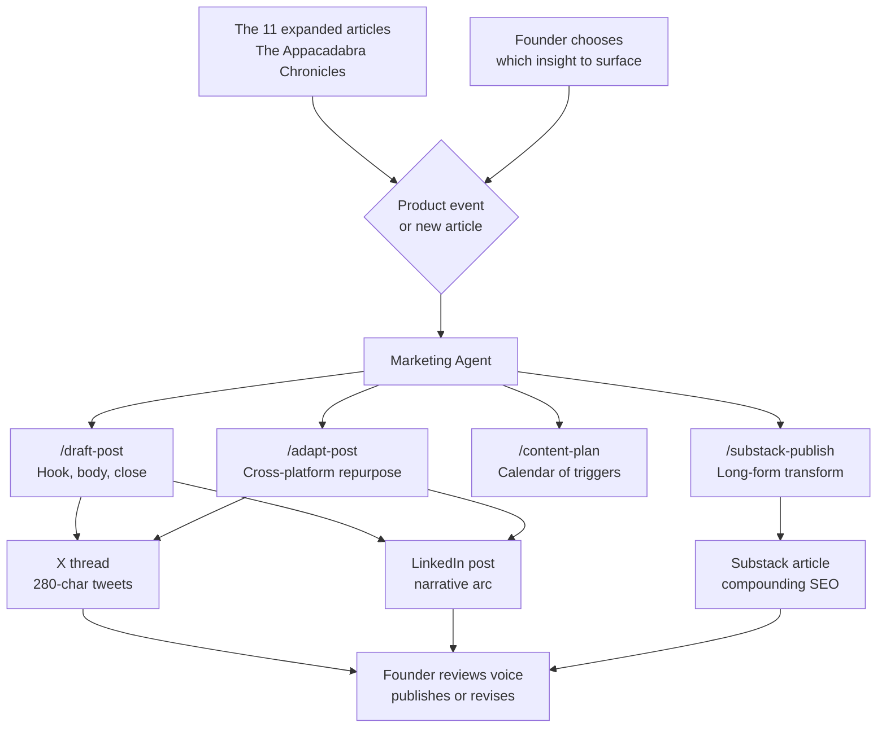

# The Appacadabra Chronicles — Expanded Blog Post (Part 9)

---

## Part 9: The Marketing Department — Making the Product Visible

There is a paradox at the center of technical founding: the better an engineer you are, the more convinced you become that if the product is good enough, it will find its audience on its own.

It won't.

The graveyard of well-engineered, poorly marketed software products is one of the longest lists in the history of the technology industry. **Google Wave** was technologically remarkable and collapsed in under two years because Google could not explain what it was for. **Betamax** was a superior format to VHS by most technical measures and lost the format war decisively. **Segway** was a genuine engineering achievement that failed to find a mass market, in part because no one was able to communicate who it was actually for.

The pattern is consistent: a product that exists but isn't talked about does not exist in the market. Marketing is not the polish on top of a product. It is the function that makes the product real — in the minds of the people who might use it.

I am an engineer. I knew this intellectually. Executing it alone, without a marketing team, on a four-month timeline, was a different kind of problem.

### The Technical Founder's Marketing Failure Mode

Most technical founders approach marketing the way they approach debugging: as a problem to be solved once and then closed. Write a landing page. Post once on LinkedIn. Submit to Product Hunt. Done.

This is not marketing. This is the illusion of marketing.

Real marketing is a content system — a repeating engine that keeps the product visible, tells new stories about it as it evolves, and meets potential users at the moment they're receptive. It requires a consistent voice, a content calendar, and the capacity to produce output at the cadence that each platform demands.

On X, that cadence is daily or near-daily. A tweet thread introducing a product feature has a lifespan of hours before it is buried in the feed. On LinkedIn, the cadence is two to three times per week — longer-form posts that build professional credibility over time. On a blog, the cadence is weekly or bi-weekly, with articles substantial enough to generate search traffic and social sharing.

For a solo founder with nine other departments to run simultaneously, that content volume is impossible to produce manually. And outsourcing it to a generic copywriter produces generic output — content that could be about any product, in any voice, with any personality.

### Claude as Content Department

I brought **Claude** in as my Marketing Department. The specific challenge it needed to solve was not just "write posts" — it was "write posts that sound like Appacadabra, not like AI-generated content."

The distinction matters enormously. There is a register of AI-generated marketing content that has become immediately recognizable: a certain formulaic structure, an overuse of em-dashes, a tone that is simultaneously enthusiastic and hollow. It performs adequately in engagement metrics and drives exactly zero emotional connection with the reader.

What makes Appacadabra's voice different is the magic metaphor: spells, mana, casting, conjuring. This is not just branding decoration. It is the product's actual UI language, established back in the Branding Department in Part 2 and carried into every other layer since (the Mana pricing primitive in Part 5 inherited it directly). The app calls operations "spells." The credit system is "mana." The act of creating an app is "casting." When marketing content uses this vocabulary consistently and naturally, it doesn't feel like a theme slapped on top of a tech product. It feels like the product has a genuine personality.

Getting Claude to maintain this voice required the same architectural approach that made every other department work: not a prompt, but a **configured agent** that knew the company's vocabulary, the audience's level of sophistication, and the distinct format requirements of each platform.

### Platform Mechanics: X vs LinkedIn

X and LinkedIn are not just different platforms. They are different communication contracts with the reader.

**X** rewards compression. A thread on X must deliver value in the first tweet — because if the first tweet doesn't stop the scroll, the rest of the thread doesn't exist. Each tweet is 280 characters. Each subsequent tweet in a thread must earn its continuation. The optimal cadence is specific, direct, and ends with a payoff. For technical founders, the most effective format is often the "I did a thing and here's what I learned" thread — personal, concrete, with a counterintuitive insight at the center.

**LinkedIn** rewards narrative depth. The platform's algorithm amplifies posts with high engagement in the first hour, which means posts need to open with a hook strong enough to generate comments — not just likes. LinkedIn's audience is professional and expects some level of credibility signaling. A post about "how I built a company with AI" lands differently on LinkedIn than on X because the reader expects to take something actionable away from it. Length is an asset, not a liability — provided the depth is real.

The **Marketing Agent** I built understood these distinctions as constraints, not as preferences. When asked to draft a post, it needed to know the platform before it produced a single word — because the same insight, told in the same voice, requires a completely different structure depending on where it lands.

### The Meta-Insight: The Series Is the Strategy

This is the point in the article where I should acknowledge something that will be obvious to any reader who has made it this far: **this series of eleven articles is itself the marketing strategy**.

It is not supplementary to the marketing strategy. It is not a documentation effort that happens to be public. The act of writing, in depth, about how Appacadabra was built — department by department, agent by agent, decision by decision — is the highest-leverage piece of content I could produce. Because:

1. It demonstrates the product's capabilities better than any feature list. Every article is evidence that the AI agents work.
2. It builds trust through transparency. Showing the failures (the DevOps wall in Part 7, the validation gap throughout) is more credible than a success story with no friction.
3. It generates content at every level of the funnel simultaneously. Individual posts on X drive top-of-funnel awareness. The full series on a blog or Substack drives bottom-of-funnel conviction.
4. It compounds. An article published today generates search traffic indefinitely. A tweet published today is gone by tomorrow afternoon.

The Marketing Agent's job was to take the content that existed in these eleven articles and translate it into the formats and cadences that each platform required. Not to generate the content — to transmute it.

### The Content Calendar Architecture

Every piece of marketing content maps to a product event:

| Product Event | X Format | LinkedIn Format |
|---------------|----------|-----------------|
| Feature launch | "We just shipped X. Here's how it works: 🧵" | Long-form post: the problem it solves and why we built it |
| Article published | Thread summarizing the key insight | Article share with a personal take |
| Milestone hit (users, installs) | Single tweet with the number and what it means | Post reflecting on the journey so far |
| Lesson learned | "I was wrong about X. Here's what actually happened:" | Full narrative with specific examples |
| Behind-the-scenes | Thread: "Here's how [department] actually works at Appacadabra" | Long-form post on the architecture or decision |

The calendar is not a rigid schedule. It is a **trigger list**: when a product event happens, the Marketing Agent knows which content formats it maps to and can produce the drafts immediately, in the right voice, at the right length for each platform.

### The Marketing Agent and Its Skills

The **Marketing Agent** became the voice of the company in public.

Its **MCPs** included:

- A **Post Draft MCP** (`/draft-post`): given a topic and target platform (X or LinkedIn), produces a complete draft in Appacadabra's voice. For X: a thread structure with hook, body tweets, and a close. For LinkedIn: a hook paragraph, narrative body with a specific insight or lesson, and a call-to-action. Always uses the magic/spell vocabulary where natural, never where forced.

- A **Content Calendar MCP** (`/content-plan`): given a time period and any upcoming product milestones, produces a content calendar mapping events to formats — which articles to publish when, which milestones to highlight on which platform, and the optimal cadence for each channel.

- A **Platform Adaptation MCP** (`/adapt-post`): given a piece of existing content (an article excerpt, a feature announcement, a LinkedIn post), adapts it for a different platform — compressing a LinkedIn article into an X thread, or expanding an X thread into a LinkedIn narrative — while preserving the core insight and voice.

- A **Substack Publish MCP** (`/substack-publish`): given a blog markdown file from `docs/blog/`, transforms it into a Substack-ready format — converting Mermaid diagrams into narrative descriptions, adjusting heading levels, extracting the post title and subtitle, and writing the output to `docs/blog/substack/`. The last mile of the content pipeline: from internal documentation to public article, without manual reformatting.

The Marketing Agent meant that the moment a new feature shipped, a new article was published, or a new milestone was reached, the content machine could activate immediately — not with generic copy, but with posts that sounded like they were written by someone who had spent four months building this company and was genuinely excited to talk about it.

Because they were.

*Marketing had made the product visible. But visible in one market is not the same as visible in the right market. In Part 10, we take the distribution question global — and discover that the biggest differences between markets have almost nothing to do with language.*

---
