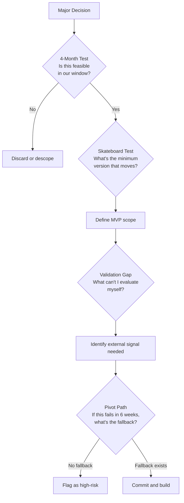

# The Appacadabra Chronicles — Expanded Blog Posts (Parts 1–3)

---

## Part 1: The Strategy Room — The 4-Month AI Challenge

There's a famous quote attributed to Dwight Eisenhower: *"Plans are worthless, but planning is everything."* He was describing the chaos of war — where no plan survives first contact with the enemy. Building a startup from scratch, alone, in four months of nights and weekends — while employed full-time — felt remarkably similar.

The company I set out to build was **Appacadabra** — a native mobile app ecosystem built on top of AI generation. Not a side project. A full company: with strategy, branding, engineering, finance, legal, analytics, release management, international expansion, and quality assurance. Every department. Every discipline. Staffed primarily by AI.

This is not a story about prompting tricks. This is a story about building a company the way a general builds a campaign — with deliberate structure, clear chain of command, and the wisdom to know which battles you can win and which ones will humble you.

### The Board of Advisors That Never Sleeps

Before I wrote a single line of code, I needed to think. Not the scattered kind of thinking that produces whiteboards full of circles and arrows. The kind of thinking that produces *constraints* — because constraints are what force a product to actually exist.

I brought **Claude** and **Gemini** in as my Board of Advisors. In practice, this meant intensive back-and-forth sessions where I would propose directions and they would stress-test them: *Is this technically viable in a 4-month window? What happens if this feature fails to resonate? Where is the MVP line — the skateboard before the Tesla?*

The "skateboard to Tesla" framing comes from Henrik Kniberg's famous product evolution illustration — a concept that has become canonical in lean product development circles and is central to Eric Ries's *The Lean Startup*. The idea: don't build half a car. Build a skateboard first. It moves. It solves the core problem. You iterate from there.

With AI as my advisors, I could run those iterations in conversation, not in production. I tested 12 different product positioning angles before landing on one. I stress-tested the technical stack against my 4-month constraint. I identified three potential pivot paths before committing to the primary one.

What would have taken a founding team weeks of heated whiteboard sessions happened in days of deep AI dialogue.

### The Decision That Changed Everything

At the end of the strategy phase, I made a deliberate, uncomfortable choice: native Android development.

I had no formal background in it. No Android engineering experience. No prior published apps. This was not strategic comfort — it was strategic ambition. I wanted to know if AI could guide a product end-to-end in a domain where I couldn't rely on my own expertise as a safety net. It was the most honest test I could run.

Spoiler: it could. But not without cost.

### The Hardest Truth About AI-Staffed Companies

Here is the insight that threads through every single part of this series, the one I want you to hold onto:

> **When you staff a company with AI, the hardest part is not generating the work. It's validating the output in departments where you are not an expert.**

This is a fundamentally different challenge than what most AI productivity content discusses. People talk about AI making you 10x faster. That's true. What they don't discuss is the epistemological problem: *how do you know if what the AI produced is correct when you don't have the domain knowledge to evaluate it?*

Code I can validate. I am a software engineer. When Claude writes an Android coroutine or a Firebase Cloud Function, I can read it, reason about it, test it, and catch errors.

But when Codex drafts a Privacy Policy clause about GDPR Article 13 obligations? When Gemini recommends a go-to-market channel for the Indian mobile market? When Vertex AI generates a brand logo?

I had to act as CEO of departments I had never formally studied. I had to develop a meta-skill: *knowing how to critically evaluate expert output without being an expert yourself.* This is, incidentally, what good executives do. AI didn't eliminate that need. It accelerated me into it.

### The Strategy Agent and Its Decision Framework

The Strategy Agent that emerged from this department was built around a specific problem: how do you make consequential decisions about a product you've never built before, in a domain you can't fully evaluate, against a deadline you can't extend?

I encoded four questions that I found myself asking — and that the AI needed to ask alongside me — every time a major decision came up:

- **The 4-Month Test**: Given our available time, is this feasible? Not "could a large team do this" but "can one founder with AI support do this in the window?"
- **The Skateboard Test**: What's the minimum version of this that moves? What is the skateboard before the Tesla?
- **The Validation Gap**: What is the largest decision in this choice that I cannot evaluate myself? Where do I need external signal before committing?
- **The Pivot Path**: If this direction fails in six weeks, what's the fallback? Is there one?

These four questions, applied consistently across the 12 positioning angles I tested, the technology stack decision, and every feature prioritization that followed, produced what a good strategy process always produces: *constraints that liberate*. Once you know what you're building, for whom, in what timeframe, and with what fallback, every downstream decision becomes faster.

The Strategy Agent held these constraints as persistent context. Every strategic question that came later — should we add this feature, should we enter this market, should we change this pricing tier — was answered against what had already been decided. Not overruled by it. Tested against it.

*The map existed. Now the company needed a face. In Part 2, Vertex AI takes the role of creative studio — and the most important question turns out not to be "can AI design?" but "do you know what you want?"*

---

---

## Part 2: The Branding Department — Forging Identity with Vertex AI

Strategy had given Appacadabra a direction: native Android, four-month window, AI as the staffing model. A positioning angle that had survived twelve rounds of stress-testing. What it hadn't given us yet was a face — and a company without a face is not a company. It is a business plan.

There is a story about Steve Jobs that has been told so many times it has become mythology. In 1984, during the Mac development, Jobs reportedly flew to Xerox PARC, saw the graphical user interface, and immediately understood it would change computing forever — not because he was a computer scientist, but because he had taste. He had spent a decade studying calligraphy, Bauhaus design principles, and what makes things *feel* right.

I am not Steve Jobs. But building Appacadabra forced me into a similar position: I needed to make design decisions at a high level without having the formal training to validate them at the pixel level. The question was whether AI could bridge that gap.

It could. But the bridge had a toll.

### Why Design Is the Most Underestimated Startup Expense

Most first-time founders dramatically underestimate what professional brand and visual identity costs. A credible design studio — logo, brand guidelines, color system, typography, promotional video assets — typically runs between $15,000 and $80,000 for a pre-Series A startup, and takes 6 to 10 weeks. For a solo founder bootstrapping without external capital, that's not a line item. It's a wall.

The traditional alternative is to use template-based tools like Canva or Looka and accept that your brand will look like every other startup that used the same template. In a market where the first impression is made in under 200 milliseconds (per research published in the *Journal of Marketing*), visual differentiation is not aesthetic vanity — it's conversion engineering.

I needed a third path.

### Vertex AI as the Creative Studio

I brought **Vertex AI** in as my Branding Department. What this meant in practice: structured creative briefs, iterative generation cycles, and rigorous evaluation of outputs against the brand positioning that the Strategy Department had already defined in Part 1.

The brief was specific: the visual identity of Appacadabra needed to communicate *magic, precision, and accessibility* simultaneously. The name itself — a play on "Abracadabra" and "App" — already encoded a personality. The AI needed to extend that personality into a visual language.

What Vertex AI produced in hours: logo concepts across three stylistic directions, a defined color palette with accessibility-compliant contrast ratios (WCAG 2.1 AA standard), typography pairings, and promotional video asset templates. Industry analysts at firms like Gartner have tracked the rise of what they call "Generative Creative Suites" — and what I was doing in a single afternoon was the prototype of what advertising holding companies are now building as enterprise products.

The quality was not "good for AI." It was good. Full stop.

### The Creative Director Problem

But here is where the story gets honest.

Dieter Rams — the legendary industrial designer behind Braun's product line and the spiritual godfather of Apple's design language — had a principle: *Good design is honest.* Part of honesty is knowing what you don't know.

I don't know design formally. I know what resonates with me aesthetically and what doesn't. I know enough about color theory to evaluate warmth vs. coolness, enough about typography to distinguish a display font from a body font. But the nuances? The kerning decisions, the golden ratio application, the psychological connotations of specific hue saturations?

I had to make confident decisions without complete information. What I discovered is that this is actually what Creative Directors do — they don't execute the pixels, they make the strategic choices between high-quality options produced by their team.

Vertex AI made me a Creative Director by producing options of sufficient quality that my decisions felt real, not arbitrary.

### The Branding Agent and Its Skills

This was also the point where the pattern that would define this entire project took shape.

After completing the initial brand work with Vertex AI, I built the **Branding Agent** — a specialized agent configured with Appacadabra's full visual identity as context. I then generated **plugins and MCPs** that encoded our design decisions as executable constraints:

- A **Visual Brief Generator MCP** (`/design-brief`) that takes a product feature description or asset request and produces a structured design brief in Appacadabra's brand voice — including color and typography constraints from `lib/theme.ts`, WCAG AA accessibility requirements, dimension specs, evaluation criteria, and a production-ready prompt for Vertex AI image generation

The next time I needed a new promotional banner, an in-app illustration, or a social media template, the Branding Agent could produce it already knowing what Appacadabra looks like — not generic output, but on-brand output. The agent learned the company's aesthetic DNA and held it.

### The Real Unlock: Taste, Not Tool

The most important insight from this chapter isn't about Vertex AI. It's about what AI does to the relationship between taste and execution.

Before AI, taste without technical skill was frustrating. You could see the vision but couldn't build it. After AI, taste becomes the scarce resource. The execution is abundant. The bottleneck shifts from *can you make it* to *do you know what you want*.

That shift has massive implications for who can build a company. A solo technical founder launching with agency-level polish was previously impossible at this scale. Now, the constraint is clarity of vision — and that's something no tool has automated yet.

*From identity to experience: in Part 3, we take the brand into the product, and discover why the browser is the best mobile prototyping tool you've never considered.*

---

---

## Part 3: The UX/Product Department — Fast UI Mockups with Claude

The brand existed: a color system, a visual language, a name that encoded personality. Vertex AI had produced outputs that a design studio would have been proud to ship. But a brand that lives only in style guides is not yet a product. It needed screens — and before screens, it needed a harder question: *Does this flow actually work when a real person tries to use it?*

In 2001, Jeff Hawkins — the inventor of the PalmPilot — famously walked around with a wooden block in his pocket. The block was roughly the size and shape of what he imagined a handheld computer should be. He would pull it out during meetings, pretend to tap on it, and ask himself: *Is this actually useful? Would I really do this?*

He was prototyping. With a block of wood. The insight was profound: **the fidelity of the prototype matters far less than the quality of the question it lets you ask.**

I kept coming back to that story throughout Part 3 of building Appacadabra.

### The Design-to-Code Pipeline Has Always Been Broken

The history of software product development is, in many ways, the history of attempts to fix the gap between what designers imagine and what engineers build.

Sketch gave designers pixel-perfect control. Zeplin tried to translate those pixels into developer specs. InVision created clickable prototypes. Figma merged design and collaboration. Yet despite decades of tooling innovation, the handoff from design to code has remained one of the most friction-laden transitions in the software industry. Ask any product team: the Figma file and the shipped product are always different. Always.

For a solo founder entering native Android development with no design team, this pipeline wasn't just inefficient — it was inaccessible. I wasn't going to hire a designer, produce Figma specs, and hand them to myself as an Android engineer. That loop had too many moving parts.

I needed to collapse it.

### The Browser as the Universal Prototype Environment

The insight: **every screen in a mobile app can be represented as an HTML/CSS layout in a browser, and Claude is exceptionally good at generating both.**

Instead of fighting the design-to-native-code pipeline, I bypassed it. I asked Claude to build interactive HTML and CSS mockups of every key screen in Appacadabra: the onboarding flow, the main editor, the runner view, the paywall, the settings panel, the profile screen.

The result was a fully interactive prototype running in Chrome. No Gradle build. No Android emulator startup time (which, on a mid-tier development machine, can easily consume 3–5 minutes per cycle). No APK installation. Just a browser tab.

This is the Build-Measure-Learn loop from Eric Ries's *Lean Startup*, operating at maximum efficiency. Every iteration I made cost seconds, not minutes. And when you're making dozens of structural decisions per day — navigation hierarchies, component placement, information density — that difference compounds dramatically over weeks.

I tested real UX questions in this environment: *Does the main action button feel immediately discoverable? Does the empty state communicate enough to guide a first-time user? Is the paywall positioned before the user has seen enough value, or after?*

These are not code questions. They are product questions. And the browser let me answer them cheaply.

### The Translation Step

Once I was confident in the UX — once the wooden block had been tested enough that I knew it was the right shape — the translation step was straightforward.

I gave Claude the HTML prototype and a set of Android-specific constraints (Material Design 3 guidelines, our design system tokens from Part 2, Jetpack Compose component naming conventions) and instructed it to produce production-ready native Android UI code.

Because the structural decisions had already been made and validated in the browser prototype, the native code that came back was clean. It wasn't exploratory code that would need to be rearchitected. It was implementation code for a design that had already been thought through.

And here's the key point: **as a software engineer, I could validate native Android code with much higher confidence than I could validate a design decision.** I was moving work into the domain where I had expertise — and using AI to do the exploratory work in the domain where I didn't.

### The UX Agent and Its Skills

The UX Agent that emerged from this department was particularly powerful.

Its **MCPs** included:
- A **Screen Specification MCP** (`/screen-spec`) that takes a user story and produces a structured screen spec: information hierarchy, key actions, empty states, error states, navigation behavior, Zustand/DB/Firebase data requirements, and a browser-testable HTML mockup scaffold — all grounded in Appacadabra's Expo Router navigation structure and `lib/theme.ts` design tokens

Every subsequent product decision in the project ran through this agent. New features were specified through `/screen-spec`, the resulting HTML scaffold validated in the browser, and then implemented natively against the agreed spec. The agent knew the product's navigation structure and data layer well enough to produce screen specs that required minimal revision before build.

### What This Taught Me About Where AI Excels

There's a framing I find useful: AI performs best when the problem has **a right answer that can be evaluated by reference to known standards**.

HTML/CSS layout has known standards: browser rendering, accessibility guidelines, visual hierarchy principles. Native Android code has known standards: official API contracts, compile-time errors, performance profiling.

Where AI struggles is where evaluation requires *accumulated human judgment* — the kind of taste that develops over years of shipping products and watching real users interact with them. That's the gap I filled as the human in this loop.

The UX department didn't produce a product that felt like it was designed by a machine. It produced a product that felt like it was designed by someone who cared — because a human who cared was in the room the entire time, steering.

*The interface was taking shape. Now it needed an engine. In Part 4, we staff the Engineering Department — and learn why treating AI as a monolith is one of the most expensive mistakes a technical founder can make.*
