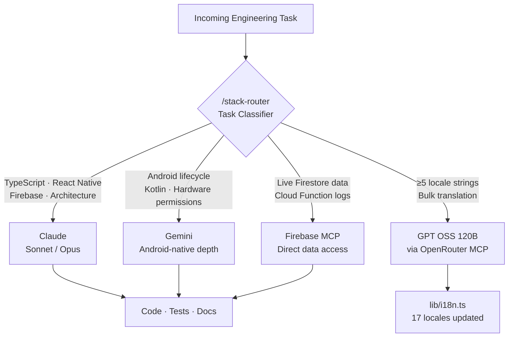
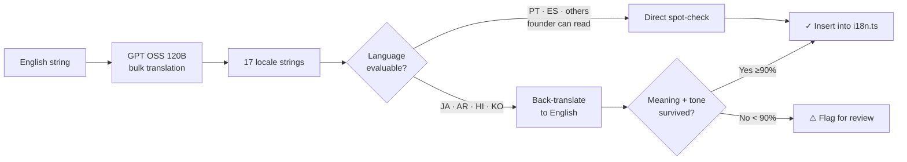
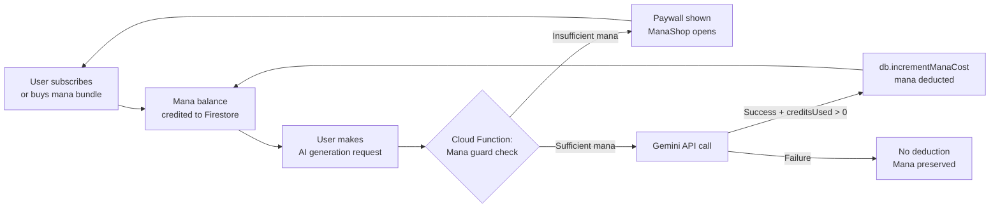

# The Appacadabra Chronicles: Expanded Blog Posts (Parts 4–6)

---

## Part 4: The Engineering & Localization Teams. A Polyglot Tech Stack

Strategy had defined the product. Design had given it identity. UX had validated its flows in a browser, screen by screen, before a single line of native code was written. Three departments had produced documents, mockups, and constraints, but not a working app. That changes in Part 4.

In 1986, Frederick Brooks published an essay that would become one of the most cited texts in software engineering: *"No Silver Bullet: Essence and Accidents of Software Engineering."* His central thesis: there is no single technique, tool, or methodology that will dramatically improve programmer productivity across all dimensions. The essence of software (its complexity, changeability, invisibility, conformity) resists any single solution.

Nearly forty years later, I believe AI has changed the terms of this argument. But Brooks's deeper point still holds: **the dangerous trap is believing you've found the silver bullet.** The moment you start routing every engineering challenge through a single AI model, you've already lost.

### The Mixture of Experts Problem

In modern machine learning, there's an architectural pattern called **Mixture of Experts (MoE)**. The intuition is elegant: instead of training one massive model that must be good at everything, you train several specialized models and learn a routing mechanism that sends each input to the model best suited to handle it. Models like Google's Gemini Ultra are widely believed to use MoE architectures internally.

I applied this concept to my Engineering Department.

The codebase of Appacadabra is genuinely polyglot. Not in the "we use two languages" sense, but in the "each layer of the stack has meaningfully different complexity profiles" sense:

- **React Native / Expo** for the cross-platform app shell, where component composition and JavaScript async patterns dominate
- **Kotlin and Jetpack Compose** for the native Android modules, where the Android lifecycle, coroutine scopes, and hardware permission flows introduce platform-specific edge cases
- **Firebase Cloud Functions** in TypeScript for the backend, with its own async execution model, cold start constraints, and IAM permission matrix
- **Google Cloud infrastructure** for the production data pipeline, including Pub/Sub, Secret Manager, and Cloud Run

No single AI model navigates all of these with equal depth. I learned this through painful experience early in the project, and the solution was to route deliberately.

**Claude Opus** (accessed through Claude Code, which served as the development environment throughout the project) was the primary engine across the stack. Claude Code is the tool, the agentic coding interface that maintains full codebase context, proposes changes, and runs commands. Claude Opus is the model powering it, and its grasp of component patterns, TypeScript generics, Firebase architecture, and context propagation is, at time of writing, the strongest available for this kind of full-stack work. It was my senior engineer across the board.

**Gemini** was brought in for Android-native depth and broad research tasks. When I needed to understand how Android's ViewModel lifecycle interacts with Jetpack Compose recomposition, or why a specific hardware permission was silently failing on API 34, Gemini's massive context window allowed me to paste entire SDK documentation sections alongside the failing code and receive coherent, targeted analysis.

**GPT OSS 120B** had a specific and narrow role: bulk localization. As an open-source model optimized for cost efficiency at scale, it was the right tool for running translation jobs across hundreds of UI strings. These are tasks where correctness-by-pattern matters more than deep contextual reasoning, and where running thousands of inferences at low cost is the actual constraint.

The Engineering Agent's routing layer became one of the most valuable assets in the project: a configuration that would receive a task, classify it by domain, and route it to the appropriate model. Not as magic, but as deliberate architecture.

This is **harness engineering** in its clearest form: not writing prompts, not fine-tuning a model, but designing the configuration layer that makes a collection of AI models behave like a coherent engineering department.

### Building the Engineering Agent

The **Engineering Agent** was the most complex agent in the system, and the most consequential.

Its **Skills and MCPs** included:
- A **Code Review MCP** (`/code-review`) that evaluated generated code against our established architecture patterns (SOLID principles, our specific folder structure, our error handling conventions)
- A **Dependency Audit MCP** (`/dependency-audit`) that cross-referenced any new package against our existing dependency tree to catch conflicts before they reached the build
- A **Stack Router MCP** (`/stack-router`) that classified incoming engineering tasks and dispatched them to the appropriate AI model (Claude for full-stack TypeScript/React Native, Gemini for Android-native depth, GPT OSS for bulk localization) with the right context injected for each
- A **Test Generation MCP** (`/gen-tests`) that, given a new function or component, auto-generated unit test scaffolding in our established testing style (Jest for the JS layer, JUnit for the Android native layer)
- A **Schema Validator MCP** (`/validate-schema`) that validated Firestore document structures and SQLite schema migrations against our TypeScript type definitions

A design principle emerged here that would shape every subsequent agent: **skills must live inside agents, not float as standalone tools.** Early in the project, `/gen-tests` and `/code-review` existed as isolated commands I ran manually. The problem was me: I was the routing layer, remembering which tool to invoke, in what order, with what context. When those skills moved into the Engineering Agent, the agent could orchestrate them as a workflow: review the code, generate tests for the reviewed code, validate the schema the code touches. Skills composed into a pipeline; loose tools did not. The Conclusion returns to this principle, and its failure modes, in detail.

The cumulative effect: by the midpoint of the project, a significant portion of engineering scaffolding happened automatically. New features were generated already conforming to our architecture. Tests were generated alongside implementation. The Engineering Agent didn't just write code; it wrote code that *looked* like the rest of the codebase, because it had been trained on the codebase.

### The Localization Challenge: Democratizing the Enterprise Moat

Localization is one of the least discussed but most expensive engineering disciplines at scale. Netflix reportedly maintains localization infrastructure across 190+ countries and 30+ languages. Airbnb's localization team is a dedicated engineering function. The tooling, the translation management systems, the QA pipelines for verifying right-to-left layout behavior: it adds up to something that is genuinely inaccessible to a solo founder.

My **Localization Team** was staffed by **GPT OSS 120B**, an open-source model chosen specifically for its cost efficiency at scale. Running translation jobs across hundreds of strings in multiple languages simultaneously requires a model that can handle high-volume, repetitive inference cheaply, not one optimized for deep reasoning.

The workflow: extract all UI strings into a JSON key-value manifest, pass batches through the model with a system prompt that included Appacadabra's tone of voice guidelines, and regenerate the locale files. For languages I could partially evaluate (Spanish, Portuguese), I could spot-check directly. For languages I couldn't (Japanese, Korean, Arabic), I used a **reverse-prompting technique**: take the AI-translated string and ask a separate model to back-translate it into English, then evaluate whether the meaning and tone had survived the round trip.

This is not a perfect validation method. I want to be honest about that. Back-translation catches semantic errors but misses cultural connotation, humor register, and regional idiom. The honest acknowledgment: **this was a calculated acceptance of imperfect validation in exchange for global reach that would otherwise have been impossible.**

The **Locale String MCP** that emerged from this work has two commands. `/add-locale-string` handles new keys: given any UI string key added in English, it automatically generates translations across all 17 supported locales via a single OpenRouter API call (using a cheap multilingual model, fractions of a cent per run), applies back-translation verification, flags strings with confidence below a threshold, and inserts them into `lib/i18n.ts` with consistent formatting. `/update-locale-string` handles updates: given an existing key and a new English value, it re-translates into all 17 locales and replaces the values in both `lib/i18n.ts` and `website/js/translations.js`. What had been a multi-week project at a well-funded startup became a pipeline that ran in minutes, and changing a single word across 17 languages became a one-liner.

*The product could now be built in any language. The question became: could the business survive long enough to need that capability? That question sent me to the Finance Department.*

---

---

## Part 5: The Finance Department. Engineering "Mana"

The Engineering Department had produced a working product: a native Android app that could generate mini-apps from text descriptions, run them locally, and bridge to device capabilities through a custom WebView. It was technically impressive. Whether it was financially viable was a completely separate question, one that I had been deliberately deferring until I had a real product to price.

There is a scene in the HBO series *Silicon Valley* where the founder of Pied Piper realizes, after building a technically magnificent product, that he has no idea whether his business model actually works. He had optimized for compression ratios. He had not optimized for revenue.

It is, in the startup world, a comedy. In real life, it is a tragedy that plays out constantly.

The AI era has introduced a new variant of this problem. VC firm **Sequoia Capital** named it directly in their 2023 analysis: the "AI Profitability Gap." The math is simple and brutal: generative AI features cost money to run. Every image generated, every text completion, every embedding computation draws from an API budget that scales linearly with usage. If your pricing model doesn't cover your inference costs before you reach scale, you are building a machine that destroys value faster as it grows.

I had to solve this before launch.

### The Unit Economics of AI Generation

The specific challenge with Appacadabra: the core product value is AI-generated content. Users interact with the product, make requests, and receive generated outputs. The cost of those outputs (API tokens, inference time, model fees) is paid by me. The revenue (subscription fees, in-app purchases) is paid by the user.

For the business to survive, one simple inequality must hold at every point:

**Revenue per user > Cost per user**

This sounds obvious. It is astonishingly easy to get wrong.

The variables are treacherous. API costs fluctuate with model versioning. Usage patterns are non-linear: power users consume disproportionately more than average users. Conversion rates from free to paid are notoriously hard to predict before you have real user data. And in subscription businesses, the time between acquiring a user and recovering their acquisition cost can span months.

I needed a CFO who could hold all of this in their head simultaneously and run scenarios faster than I could think of them.

### Google Sheets AI + Gemini as CFO

My Finance Department was staffed by **Google Sheets with Gemini integration**, a combination that is, frankly, underestimated in the entrepreneurial community.

The setup: a structured financial model in Google Sheets, with Gemini providing the analytical layer. I fed the model our cost structure (API pricing tiers from OpenAI, Anthropic, and Google; Firebase infrastructure costs at various scale points; estimated App Store fees), our hypothetical user acquisition scenarios (conservative, moderate, aggressive), and our candidate pricing structures.

Gemini ran what I can only describe as Monte Carlo-style scenario analysis. Not the formal mathematical implementation, but the conceptual equivalent: generating hundreds of combinations of assumptions and evaluating which pricing structures remained profitable across the widest range of scenarios.

What emerged was our **Mana system**.

### The Architecture of Mana

"Mana" is a concept borrowed from role-playing game design: a resource that powers magical abilities, regenerates over time, and can be expanded through purchases. In game design terms, mana is the canonical solution to the "how do you price a consumable feature" problem.

The Appacadabra implementation: users receive a base mana allocation with their subscription tier. Each AI generation consumes a defined mana amount calibrated to its actual API cost plus margin. Mana can be expanded through in-app purchase bundles. The system is transparent to the user (they always know their remaining capacity), gamified (spending mana feels like using a resource, not paying a fee), and profitable (every unit of mana issued has been paid for).

The financial model demonstrated that this structure could sustain profitability across all reasonable user scenarios, including scenarios where 20% of users were in the top usage decile, the scenario that kills most subscription AI products.

### From Model to Implementation

Once the financial structure was proven mathematically, it moved to the Engineering Department. The implementation touched multiple layers of the stack: in-app purchase integration with Google Play Billing, server-side mana ledger in Firestore, real-time balance display in the UI, and consumption logic gated at the Cloud Function layer.

This was pure code, and therefore something I could validate with full confidence. The financial model told me *what* to build. Engineering told me *how* to build it. The Finance Agent connected them.

### The Finance Agent and Its Skills

The **Finance Agent** was built to make the ongoing financial health of the company legible without requiring me to rebuild the model from scratch every time a variable changed.

Its **MCPs** included:
- A **Mana Calibration MCP** (`/mana-calibrate`): given the current API pricing for each model and observed token consumption from Firestore usage logs, recalculate the mana cost of each feature to maintain target margins, outputting a ready-to-apply diff against the current cost constants

The Finance Agent meant that pricing decisions (which in a traditional startup would require a CFO, a financial analyst, and a board conversation) could be simulated and evaluated in minutes, with Appacadabra-specific data already loaded.

*The economics were sound. But even an app with a privacy-first, local-first architecture, as Appacadabra deliberately is, cannot exist in a legal vacuum. In Part 6, we encounter the most intimidating department to outsource to a machine: Legal.*

---

---

## Part 6: The Legal Department. Navigating Compliance with Claude Opus

The financial model was sound. The Mana system had passed every scenario the model could generate. The product worked, had a price, and had been built for scale. What it didn't yet have was a legal foundation, and an app without one is a single Play Store policy review away from disappearing entirely.

Paul Graham, in his essay *"Do Things That Don't Scale,"* argues that early-stage founders should do uncomfortable, manual things precisely because they don't scale. The point: before you can automate something, you have to understand it well enough to know what you're automating.

Legal compliance is the domain where this lesson stings hardest. Most startup founders don't understand GDPR well enough to know what they're complying with. They outsource it entirely to attorneys, receive documents they barely read, and sign off, hoping the lawyer caught everything. It's expensive, and it's also a kind of epistemic surrender: you've created a legal foundation for your company without really understanding what it says.

I wanted to do this differently.

### The Regulatory Landscape for a Privacy-First AI App

Appacadabra was designed from the ground up with a deliberately local-first, privacy-first architecture. Understanding what that means in practice is essential to understanding what the Legal department actually needed to document:

- **Spell descriptions** (the user's text prompts) are sent to the **Google Gemini API** for processing. That's the only external data transmission.
- **All generated content** (the spells, version history, preferences) is stored **exclusively on the user's device**. We do not maintain servers with personal user data.
- **Device permissions** (contacts, camera, microphone, location, health data via Health Connect) are accessed only when a generated spell explicitly requires them, with no transmission to our servers.
- **Anonymous analytics** may be used to understand aggregate usage patterns, but no personally identifiable data is collected or stored by Appacadabra.

This architecture was a deliberate choice, not just for user trust, but because it dramatically simplifies the compliance surface. When you don't collect data, you don't have most of the GDPR problems. When everything runs locally, you don't have a breach surface.

That said, the legal obligations that *do* exist are non-trivial:

**GDPR** still applies to the spell description data transmitted to the Gemini API; that transmission constitutes processing, and disclosure is required.

**LGPD** requires equivalent disclosures for Brazilian users, with specific provisions around the legal basis for the Gemini API processing.

**COPPA** mandates that we do not knowingly serve users under 13, a requirement that applies even without data collection.

And then there are the AI-specific questions that existing regulatory frameworks are still catching up to: who owns AI-generated content produced from a user's prompt? What obligations arise from the transmission of user descriptions to a third-party model API?

The legal document set I needed was precise, not generic.

### Claude Opus as Legal Counsel

I turned to **Claude Opus** (via Claude Code) as my primary legal drafting tool. The LegalTech industry has produced compelling evidence that LLMs can navigate dense legal text with high fidelity. Companies like **Harvey AI** (backed by Sequoia and General Catalyst) and **Ironclad** have built enterprise-grade products on exactly this capability.

A key advantage of using Claude Opus through Claude Code for legal work: the agent already had full context of the codebase (every data flow, every third-party integration, every permission request) through the Google Conductor context-driven development framework. I didn't need to manually describe what the app does. The agent *already knew*, because it had been working alongside me building it.

My approach was structured and specific. I did not ask the AI to "write a privacy policy." I provided:

1. A precise technical description of every data flow: what leaves the device (only spell descriptions, to the Gemini API), what stays local (all generated content, preferences, version history), and what permissions are requested and under what conditions
2. The list of third-party services: Google Gemini API, Google Play Billing, Google Health Connect, Firebase (anonymous analytics only), Expo push notifications
3. The target jurisdictions (EU, Brazil, US, and global)
4. The specific legal bases for the one external processing operation: the Gemini API transmission

Claude Opus produced draft documents that mapped precisely to the product's actual architecture. Not a generic privacy policy template, but one that accurately reflected the local-first model. GDPR Article 13 disclosures scoped specifically to the Gemini API processing. LGPD-aligned basis declarations. COPPA age-restriction acknowledgments.

I read every single line.

### The Validation Protocol

This is not a detail to skim over. Reading a legal document you didn't write, in a domain you don't formally understand, is an uncomfortable exercise. But I developed a validation protocol:

1. **Factual Accuracy**: Every clause describing what Appacadabra does must match the actual technical reality of the product. If the document says "we do not share your data with third parties for marketing purposes," I need to verify that is actually true in every data flow.
2. **Reference Checking**: Any specific regulatory citation (Article 13, LGPD Article 7, COPPA Section 312) should be cross-referenced against the actual legislative text to ensure it's cited accurately.
3. **Omission Hunting**: What is the document *not* saying? Gaps in a Privacy Policy are often more legally dangerous than incorrect statements. I would explicitly ask the AI: *"What disclosures might be missing from this document given the technical description I provided?"*
4. **Contradiction Detection**: Legal documents often contain internal tensions. I would ask the AI to evaluate the document for internal consistency.

This protocol doesn't replace a qualified attorney. But it transforms the engagement with legal documents from passive acceptance to active evaluation, and it makes a qualified attorney's time dramatically more efficient if you do eventually engage one.

### The Legal Agent and Its Skills

The **Legal Agent** became the compliance backbone of the company.

Its **Skills and MCPs** included:
- A **Feature Compliance Audit MCP** (`/compliance-check`): given a description of a new product feature, generate a compliance checklist. What new data processing does this introduce? What disclosures might need updating? What consent mechanisms are required? Evaluated against GDPR, LGPD, and COPPA obligations specific to Appacadabra's privacy-first architecture
- A **Policy Diff MCP** (`/policy-diff`): given a proposed change to the Privacy Policy or Terms of Service, generate a plain-language summary of what changed, flag whether user re-consent is required, and identify any internal contradictions introduced by the change

The Legal Agent meant that as Appacadabra evolved (as new AI models were integrated, as new features were built) the compliance layer evolved with it, not months later when a lawyer finally reviewed it.

### A Note on Departments Not Yet Built

At this point in the series, it's worth acknowledging something explicitly: not every company department needed to exist yet.

Customer Service, Sales, PR, Investor Relations, HR, Accounting: none of these departments were created. Not because they're unimportant, but because **the app is only now going to production**. The principle I applied was the same one that drove the entire project: build what the company actually needs at this stage, not what a fully mature company would need at scale.

The agent-and-plugin architecture means that when these departments do become necessary (when the first user emails with a support question, when the first partnership opportunity emerges) I will build the agent for that department the same way I built the others: starting with the specific context of Appacadabra, encoding the first manual interactions as skills, and formalizing them as MCPs. The pattern scales.

*With strategy, design, UX, engineering, finance, and legal in place, Appacadabra existed: on paper, in code, and in compliance. But a company that exists only in code is not a company. It's a repository. In Part 7, we turn to making the company legible: Data Analytics and DevOps.*
