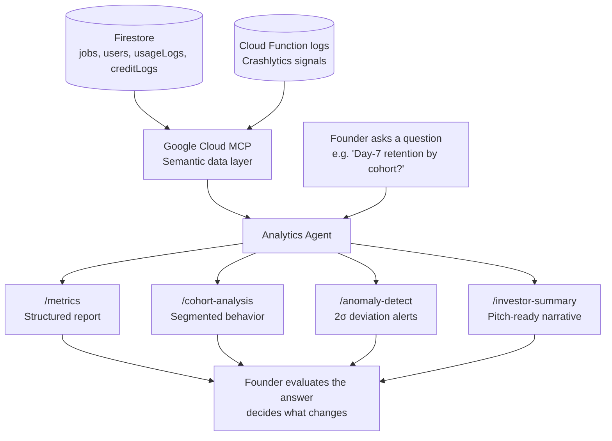
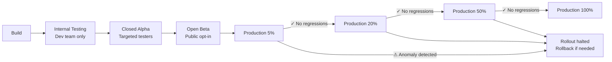
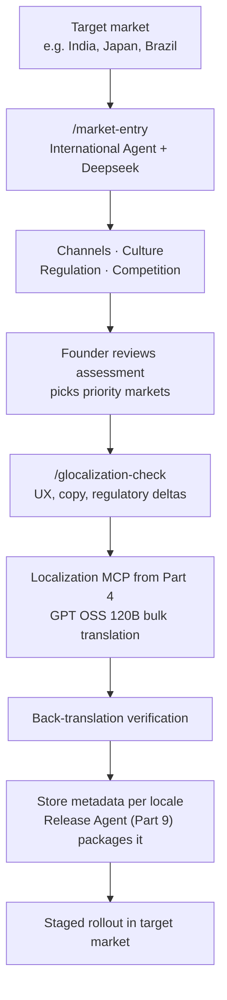

# The Appacadabra Chronicles: Expanded Blog Posts (Parts 8, 9, 11)

---

## Part 8: Data Analytics & DevOps. Cloud Infrastructure Friction

Seven departments. A company that existed on paper, in code, validated by automated tests, modeled financially, and grounded in legal documents. Appacadabra was real, but invisible to itself. No one was watching what was happening inside it. No one was measuring whether the decisions made in the first seven departments were actually working in practice. That was about to change.

There is a concept in reliability engineering called **observability**: the degree to which you can infer the internal state of a system from its external outputs. In traditional software operations, observability is achieved through three pillars: logs, metrics, and traces. Building this infrastructure (the agents, dashboards, alerting pipelines, and on-call runbooks) is itself a significant engineering discipline.

In the modern AI-first enterprise, observability has a fourth dimension: **the AI layer that interprets the first three.**

This is where Part 8 begins: not with code, but with data. Specifically, the question of how a solo founder, with no dedicated data analyst and no BI platform budget, could understand what was actually happening inside their product.

### The AIOps Revolution (and Why It Matters for Startups)

"AIOps" (using artificial intelligence to augment or automate IT operations) has been a Gartner-tracked trend since 2017. In enterprise contexts, it typically means AI parsing log streams to detect anomalies, correlating incidents across distributed services, and auto-remediating known failure patterns. Tools like **Datadog AI, Dynatrace Davis, and Google Cloud's Operations Suite** represent the mature end of this spectrum.

For a solo founder, the relevant insight is simpler: **AI can turn raw data into understanding in a way that used to require a dedicated analyst**.

Appacadabra's entire backend runs on **Firebase**: Firestore for the primary database, Firebase Authentication for user identity, Cloud Functions for server-side logic, and Firebase Analytics for behavioral data. This is an excellent, scalable stack. It is also a stack that generates enormous amounts of data that, without analysis, is just noise.

### Google Cloud MCP as My Data Analyst

I deployed **Google Cloud MCP (Model Context Protocol)** to give AI agents direct, contextual access to our Firebase data streams. The MCP layer is the key architectural piece here; it's not a query interface where you write SQL and get rows back. It's a semantic layer where you describe what you want to understand, and the AI decides what data to pull, how to aggregate it, and how to present the insight.

What this produced:

**Usage Pattern Analysis**: I could ask "Which features are driving the most mana consumption, and which user cohorts are consuming mana fastest?" and receive not a table, but a narrative with the relevant segments already identified.

**Retention Analysis**: "What is the Day-7 retention rate for users who completed the onboarding flow vs. users who skipped it?" A classic product analytics question that, in a traditional setup, requires a data engineer to write the cohort query, a BI analyst to build the chart, and a product manager to interpret it. With the MCP layer, one question produced one answer.

**Pitch Deck Material**: This one surprised me. I asked the Analytics Agent to summarize our growth trajectory for an investor context. It produced a crisp, data-backed narrative (the kind of thing that typically takes a founder an afternoon to write) in minutes, cross-referencing our Firebase metrics against publicly available benchmarks for comparable apps.

The Analytics Agent had become my intelligence function: always aware of what was happening in the product, always able to interpret it, always ready to translate data into decision. And critically, I was still the one asking the questions and judging the answers. The agent surfaced patterns; I decided which patterns mattered enough to change the product over.

### The Analytics Agent and Its Skills

The **Analytics Agent's Skills** included:

- A **Metrics Skill** (`/metrics`): query usage patterns and spend logs to produce a structured product metrics report — active users, spell creation volume, failure rates, mana consumption breakdown, and revenue signals — for any requested period
- A **Cohort Analysis Skill** (`/cohort-analysis`): segment users by behavior (power users, paying users, churned, new) and analyze engagement depth, mana consumption, and conversion timing per cohort using retention data pulled via MCP
- An **Anomaly Detection Skill** (`/anomaly-detect`): compare the last 24h of Firebase and Cloud Function data against a 7-day rolling baseline, flag deviations exceeding 2 standard deviations, and assign severity levels with root cause hypotheses
- An **Investor Summary Skill** (`/investor-summary`): pull current metrics and produce a structured investor-facing narrative — growth trajectory, retention signals, unit economics, and market benchmarks — ready for a pitch context

### Where the Constellation Frays: Crashlytics and the MCP Gap

Here is the honest part of this chapter, and I think it's the most important one to get right.

Most of the Analytics constellation worked. Firebase Analytics events, Cloud Function logs, Firestore queries — all of it flows through the MCP layer cleanly. When I asked the Analytics Agent about usage patterns, retention curves, or anomalies in spell creation volume, I got answers. The intelligence function this department was supposed to build? It built it.

The gap was specific: **Crashlytics**. Not Crashlytics as a concept, and not crashes as events — users generate crashes, the Crashlytics dashboard receives them, and the app has full crash reporting in production. The gap is operational: when a crash report needs investigation, I still open the Firebase Console myself. The Analytics Agent cannot pull Crashlytics data fluidly via MCP the way it pulls Firebase Analytics or Firestore. The loop stays open at exactly the moment you most want it closed — when something broke and you need to understand why.

The reason is structural. Configuring Crashlytics in an Android release build involves a combinatorial environment problem: dependency conflicts between libraries can produce silent failures that only surface in production, with no error signal for the agent to reason from. I found the conflict; the agent explained it. That division of labor — founder locates the problem, agent articulates the fix — is the right mental model for this kind of issue.

In all of these cases, **my developer intuition was not just helpful; it was the only thing that could locate the problem**. The agent could explain what the error meant once I found it. It could not find the error.

There are integrations where the constellation still needs the founder's eyes. Crashlytics is one, and the pattern is worth naming: when a tool's data doesn't have a first-class MCP surface, the loop stays open. That isn't a failure of the department — it's a boundary condition. Know where your specific stack has those gaps before you plan your monitoring strategy.

*The product was running, observable, and understood. But observed in production by whom? Part 9 addresses the final mile of getting an app into users' hands, and why it is an entirely separate discipline from building it.*

---

---

## Part 9: Release Management. The App Store Maze with Gemini

The product was running. Analytics were flowing. Metrics were legible. Appacadabra existed as a complete, observable system, and it existed entirely on a development device that no user could access. Getting from that state to "available on the Play Store" turned out to be one of the most unexpectedly complex transitions in the entire project.

This was the moment where every prior department had to converge into a single shippable artifact. The compliance scaffolding from the Legal Department in Part 7 had to translate into the Play Store's Data Safety form and policy declarations. The observability built by the Analytics Department in Part 8 had to feed a go/no-go decision gate at each rollout step. The financial model from Part 6 had to map cleanly to Google Play Billing SKUs that a Play Store reviewer could validate. Release was not a new layer. It was the place where every other layer got tested.

William Gibson wrote that "the street finds its own uses for things." In technology, this tends to mean that the processes built around a platform develop their own complexity, entirely independent of the underlying technology's complexity.

The Google Play Store is a perfect example of this phenomenon. The engineering of a well-built Android app is one problem. The compliance, submission, policy navigation, and staged rollout strategy of getting that app into the Play Store is a completely different problem, with its own specialist community, its own failure modes, and its own institutional knowledge that takes years to accumulate.

Large technology companies maintain dedicated **Release Engineering** teams for exactly this reason. At Google, Apple, Meta, and similar companies, the pipeline between "code merged" and "user can install it" is a managed, monitored, multi-stage process overseen by specialists. For a solo founder, this expertise doesn't exist in-house.

I needed a Release Manager. I hired **Gemini**.

### The Play Store as a Bureaucratic System

Let me be specific about what makes the Play Store difficult, because "it's complicated" doesn't convey the actual texture of the challenge.

Google's Play Console contains, at any given time, approximately 47 distinct configuration areas across App Content, Store Presence, Release Management, Monetization, Policy Compliance, and Statistics. Many of these areas have interdependencies that are not documented clearly: configuring your Target Audience declaration affects which Content Rating categories are available, which affects whether certain ad formats are permitted, which interacts with your Data Safety form responses.

Policy documents are dense, frequently updated, and written in a register that implies familiarity with legal and technical concepts most developers don't have. A single policy violation (even an unintentional one) can result in an app removal that takes weeks to resolve and leaves a permanent record in your account's compliance history.

The 2023 and 2024 policy cycles introduced significant new requirements around AI-generated content disclosure, data safety labeling for apps using on-device ML models, and health-adjacent content restrictions that caught thousands of developers off-guard.

### Gemini as Policy Navigator

**Gemini** proved exceptionally effective as a Release Management partner, specifically because it could maintain a coherent understanding of the policy landscape across long, complex conversations.

The workflow:

**Policy Translation**: I would paste sections of Play Developer Policy or Data Safety form instructions and ask Gemini to translate them into specific, actionable requirements for Appacadabra. Not "what does this mean generally" but "given that our app does X, Y, and Z, what exactly do we need to declare here?"

**Staged Rollout Architecture**: Gemini guided me in structuring the deployment pipeline across the industry-standard tracks:
- *Internal testing*: for development builds shared with a defined tester list
- *Closed testing* (commonly called "Closed Alpha"): for structured beta access with specific device/account targeting
- *Open testing* (commonly called "Open Beta"): for broader pre-production access with public join links
- *Production*: with staged percentage rollouts (5% → 20% → 50% → 100%) to limit blast radius if a production regression appeared

This staged approach is standard practice at mature companies; it's how Google itself rolls out Chrome updates. For a solo founder, having AI guide the implementation of this level of release discipline was a meaningful upgrade.

**Metadata Optimization**: App store listing copy (title, short description, full description) is effectively SEO for mobile apps; it determines discoverability in Play Store search. Gemini generated and iterated on listing copy calibrated for the specific keyword clusters relevant to Appacadabra's use cases.

### The Release Agent and Its Skills

The **Release Agent** became the operational interface between the engineering output and the public-facing product.

Its **Skills** included:
- A **Release Checklist Skill** (`/release-checklist`): generate a pre-submission checklist covering Play Store policy compliance, version bump verification, data safety form accuracy, and staged rollout configuration for the current release
- An **App Metadata Skill** (`/app-metadata`): produce app store listing copy variations (title, short description, full description) calibrated for the app's keyword clusters and localized for each supported market
- A **Release Notes Skill** (`/release-notes`): given a git diff or changelog, produce user-facing release notes in Appacadabra's brand voice, localized across every Play Store locale we ship to
- A **Rollout Health Check Skill** (`/rollout-check`): query Firebase Cloud Function logs and Firestore job data to assess production health (job failure rate, mana refund anomalies, crash signals) and output a go/no-go rollout verdict with supporting data

The Release Agent transformed launch from an event into a pipeline: a repeatable, managed process rather than a sprint of manual configuration and hope.

*The app was live in staged rollout. The pipeline was running. But available and known are two different things, and a product that exists without being talked about does not yet exist in the market. In Part 10, we staff the department that bridges that gap: Marketing.*

---

---

## Part 11: International Strategy. Conquering New Markets

The Marketing Department had made the product visible: content was flowing, X threads were reaching builders, LinkedIn articles were building credibility. Analytics were confirming that real users were creating real spells, consuming real mana, and returning. The product worked in one primary market, with seventeen locales already running but not yet tested against real users in their home countries. The marketing was working in that same market. The next question was inevitable: where else does this work, and what has to change when we try to find out?

In 1983, Theodore Levitt published an article in the Harvard Business Review titled *"The Globalization of Markets."* His central argument: technology was creating a world of homogenized consumer needs, and companies that recognized this would dominate by offering standardized, globally consistent products at lower prices than locally adapted competitors.

Levitt was right about the direction of the world. He was partially wrong about the strategy.

The companies that actually dominated global markets in the internet era (Uber, Airbnb, ByteDance, Sea Limited) didn't win by ignoring local differences. They won by combining global infrastructure with hyper-local adaptation. This became the guiding concept of **"glocalization"**: the ability to operate at global scale while adapting at local granularity.

For Appacadabra, entering Asian markets wasn't optional. It was existential.

### Why Asia First

The data that made this decision easy: as of 2024, the Asia-Pacific region accounts for approximately 55% of global mobile app downloads (data.ai *State of Mobile 2024*). India is now the world's second-largest smartphone market by unit volume, behind only China, having overtaken the United States over the past decade. China, despite its specific market access constraints, is the world's highest-revenue mobile gaming market and one of the two largest overall mobile app ecosystems by revenue, rivalled only by the United States.

For an app built on AI generation, the opportunity in these markets is compounded by a specific demographic reality: the 18-35 cohort in India and Southeast Asia has the highest mobile-first adoption rate of any demographic globally. They are not migrating from desktop to mobile. They were born into mobile. This is the native audience for what Appacadabra does.

The challenge: I know almost nothing about what makes a product actually succeed in these markets, as opposed to merely being available in them.

### Deepseek as International Strategist

I engaged **Deepseek** as the intelligence engine for international strategy. Deepseek's training data composition gives it a meaningful advantage over Western-first models when reasoning about Eastern market dynamics, consumer psychology, regulatory environments, and competitive landscapes.

What Deepseek delivered went beyond the generic market entry frameworks that any business school textbook would provide. It offered:

**Channel Strategy by Market**: In India, app discovery remains heavily driven by YouTube creator promotions and WhatsApp group sharing, not the organic App Store search that drives discovery in Western markets. In Southeast Asia, TikTok's creator ecosystem functions as a distribution layer that has no direct Western equivalent. In Japan, LINE's social graph is more influential for app sharing than any other platform. Each market required a genuinely different acquisition playbook.

**Cultural Adaptation Insights**: Beyond translation, Deepseek identified specific UX patterns that resonate differently across cultures. Japanese users, shaped by a cultural aesthetic often summarised through concepts like *wabi-sabi* (acceptance of imperfection) and *ma* (the value of negative space), have a documented preference for interface restraint over feature density. Indian users, shaped by a mobile-first culture with historically constrained data plans, have stronger tolerance for loading states than Western users but much less tolerance for data-heavy onboarding flows.

**Regulatory Landscape**: China's specific market requires a different entity structure (the complexities of WFOE vs. VIE structures), separate app distribution infrastructure (Huawei AppGallery, Tencent MyApp, Baidu Mobile), and compliance with China's Personal Information Protection Law (PIPL). Deepseek's analysis identified these constraints clearly and flagged which elements of the strategy were viable in the short term vs. which required longer-term infrastructure investment.

**Competitive Intelligence**: Who were the incumbents in the AI creation app category in each market? What were their weaknesses? Where was the whitespace? Deepseek's analysis of the competitive landscape in India and Southeast Asia identified specific positioning angles that Western AI apps were systematically missing.

### The Intersection With Localization

This is where Parts 4 and 11 connect explicitly: the localization infrastructure built by the GPT OSS models in Part 4 was not just a technical exercise. It was the foundation that made the Deepseek strategy actionable.

Market strategy without localization is aspiration. Localization without market strategy is translation. The combination (Deepseek's strategic intelligence feeding the localization system's execution capability) produced something different: **culturally coherent market entry, executed at the speed of automation**.

The International Strategy Agent integrated with the Localization MCP from Part 4 to create a compound system: propose a market, receive a localized product strategy, automatically generate the required UI string translations, back-translate for verification, and produce the App Store metadata in the target language, calibrated for the local search behavior in that market's app store.

### The International Agent and Its Skills

The **International Agent** became the company's geopolitical intelligence function.

Its **Skills** included:
- A **Market Entry Skill** (`/market-entry`): given a target country, produce a structured assessment of regulatory requirements, distribution infrastructure, cultural adaptation needs, competitive landscape, and a prioritized action plan for market entry
- A **Glocalization Check Skill** (`/glocalization-check`): evaluate any new product feature or UI copy against the cultural contexts of our active markets and flag adaptations required for each, covering UX patterns, tone of voice, regulatory implications, and localization gaps

The International Agent meant that expansion decisions (which market to enter next, which adaptations to prioritize, which channels to activate) could be informed by structured intelligence rather than instinct.

This is the Validation Gap at its widest. In Part 1, the gap was defined as the distance between what the AI can surface and what the founder can evaluate. In most departments -- Strategy, Branding, Engineering -- the founder had enough domain familiarity to stress-test the AI's reasoning. In international strategy, that familiarity collapses. Deepseek can describe the role of LINE in Japanese app discovery, or the data-plan sensitivity of Indian mobile users, with more precision than I could acquire in months of research. But I cannot verify the reasoning from experience. The only honest response to that condition is to treat the analysis as structured input, not settled fact -- to ask what assumptions the model is making, to look for contradictions against sources I can independently check, and to move slowly into markets where the cost of a wrong call is high. The agent narrows the gap. It does not close it.

*Eleven departments built. Eleven agents configured. A company assembled from a blank document, one department at a time, in the order the business actually needed them. The conclusion that follows steps outside the individual departments and maps the full architecture that emerged: the complete constellation of what was built, how the pieces connect, and what it means for the companies that come after.*
