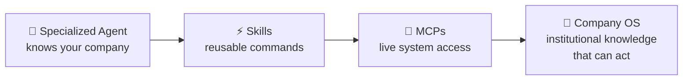

# The Appacadabra Chronicles — Preface

---

## Before We Begin: A Map of the Journey

There is a word that gets used often in the AI productivity space, and almost always incorrectly: *autonomous*.

As in: "I built an autonomous AI agent that runs my business." As in: "I set it loose and it figured everything out."

This series is not that story.

What I built over four months of nights and weekends — while holding down a full-time job, starting from a blank document and ending with a live Android app on the Play Store, serving users across multiple countries — was something more interesting and more difficult than autonomy. It was a **collaboration architecture**: a system where AI agents handled the execution of specialized work across every company department, and a human founder handled the strategic decisions, the validation, and the connective tissue that no AI can yet provide.

The company is **Appacadabra**. The product: a native Android app that lets users describe what they want — in plain language — and generates a fully functional mini-app for them, running locally on their device, powered by Google's Gemini API. Part app generator, part magic wand.

The constraint that shaped everything: **four months of nights and weekends**, working alone, with a full-time job running in parallel.

### The Central Question

Can a solo founder, working with AI as their staff, build a company — not just a product, but a company, with all the departments a real business requires — in four months?

I wanted to know if AI could serve as a Strategy Advisor who could run competitive analysis and stress-test positioning. A Branding Studio that could produce professional visual identity. A UX Department that could prototype every screen before a line of native code was written. An Engineering Team that could navigate a genuinely complex polyglot stack and manage localization across 17 languages. A Finance Department that could model unit economics and design a sustainable pricing system. A Legal Counsel that could draft privacy policies grounded in the actual architecture. A Data Analyst who could interpret live Firebase metrics. A Release Manager who could navigate the Play Store compliance maze. A Marketing Department that could create and distribute content across X and LinkedIn. An International Strategist who could map cultural and regulatory entry requirements for 10 markets. And a QA Team that could automate the validation of an AI-generated product.

The answer: yes. But not in the way the hype suggests.

### The Architecture That Made It Work

This series is not about prompting tricks or clever chatbot workflows. The key insight — the one that separates this from "I used AI to help me write stuff" — is an architectural pattern that threads through every department:

**Agent → Skills → MCPs**

For each department I built, I also built a **specialized AI agent** — not a generic assistant, but one configured with Appacadabra's full context: our stack, our voice, our policies, our constraints. Each agent knows *this company*, not just this domain.

As I completed work through each agent, I codified what I learned into **Skills** — reusable command patterns — and **MCPs** (Model Context Protocols) — structured protocols that connect the agent to live systems: Firestore, Firebase logs, the Play Store, our codebase. By the end of the four months, eleven agents and twenty-seven executable commands held the institutional knowledge of the company in a form that could act on it.

Think of it like this: traditional companies spend years encoding their processes into wikis, runbooks, and SOPs that gather dust. I was encoding them into living agents that could execute them. Every task that passed through an agent, captured as a skill, and formalized as an MCP, made the system slightly more capable and slightly more specifically *Appacadabra*.

In the engineering community, this practice is beginning to be called **harness engineering** — the discipline of building the scaffolding that makes AI reliably capable in production contexts, as distinct from prompting (getting a good answer) or model training (improving the model itself). Harness engineering is what you're doing when you configure agents, codify skills, and formalize MCPs. It is the layer between a capable model and a functioning company.

This is the new model of the software company. Not a team of humans with AI assistants. Not autonomous AI with a human supervisor. A human CEO operating a constellation of specialized AI agents, each one deeply configured to serve the company's specific context.

One warning before you dive in, because every genuinely powerful technology earns one: **the harness is a means, not an end.** It is easy — especially for technically-minded founders — to get absorbed in building agents, configuring skills, and designing the architecture of a company instead of actually running one. The eleven departments in this series were built because the business needed them, in the order the business needed them. That sequence was not accidental. A Marketing agent built before you have a product to market is a distraction with good documentation. Build the infrastructure when the business demands it — not because the infrastructure is interesting.

### How to Read This Series

Each of the eleven articles that follow covers one department. They are designed to be read in sequence — because each department was built in sequence, and each one depends on decisions made in the ones before it. The strategic decisions in Part 1 constrain the branding decisions in Part 2. The financial model in Part 5 shapes what Engineering in Part 4 actually builds. The legal groundwork in Part 6 informs the release strategy in Part 8. The marketing content in Part 9 feeds the international expansion in Part 10.

But if you have a specific domain you care about, here is the map:

---

**Part 1 — Strategy: The 4-Month AI Challenge**
*The question before the company: what to build, for whom, in what timeframe. How Claude and Gemini served as a Board of Advisors that never sleeps — and the uncomfortable decision that set the scope for everything that followed. The insight that runs through every chapter: AI accelerates you toward judgment, not away from it.*

**Part 2 — Branding: Forging Identity with Vertex AI**
*Why brand identity is the most underestimated startup expense — and how Vertex AI functioned as a creative studio that produced agency-level outputs in hours. The Creative Director problem: AI gives you options. Taste gives you answers. And taste, it turns out, is still entirely yours.*

**Part 3 — UX/Product: Fast UI Mockups with Claude**
*Jeff Hawkins prototyped the PalmPilot with a wooden block. I prototyped a mobile app in a browser. The case for using HTML and CSS as the fastest mobile prototyping environment — and why Claude excels at collapsing the gap between design intent and native implementation.*

**Part 4 — Engineering & Localization: A Polyglot Tech Stack**
*Why routing AI tasks to the right model matters as much as the tasks themselves. Claude for full-stack TypeScript, Gemini for Android-native depth, GPT OSS for bulk localization — and the Engineering Agent that coordinated them. The Mixture of Experts insight applied to a startup's technical infrastructure.*

**Part 5 — Finance: Engineering "Mana"**
*The AI profitability gap that kills most AI startups — and how I designed my way out of it. The Mana system: a pricing model borrowed from RPG game design that makes the unit economics of AI generation transparent, gamified, and profitable. The math that has to work before a single user pays.*

**Part 6 — Legal: Navigating Compliance with Claude Opus**
*Building a Privacy Policy you actually understand. The validation protocol for reading legal documents you didn't write, in a domain you don't formally know. And why a privacy-first architecture isn't just good ethics — it dramatically shrinks the legal surface you need to defend.*

**Part 7 — Analytics & DevOps: Cloud Infrastructure Friction**
*How to make a solo founder's Firebase data tell the story it's hiding. The AIOps layer that turned raw Firestore metrics into product intelligence — and the honest account of where AI breaks entirely: Android environment debugging, where human intuition built from years of debugging is still irreplaceable.*

**Part 8 — Release Management: The App Store Maze**
*The 47 configuration areas in the Play Console that have nothing to do with engineering. How Gemini served as a release engineer who had read every policy document — and the staged rollout architecture that limits blast radius when things go wrong in production.*

**Part 9 — Marketing: Making the Product Visible**
*A product that exists and isn't talked about doesn't exist in the market. How Claude served as a content department — drafting X threads, LinkedIn articles, and a content calendar tied to product milestones. And the meta-insight at the center of it: this series itself is the marketing strategy.*

**Part 10 — International Strategy: Conquering New Markets**
*Why distribution in India runs through YouTube, not app store search. Why Japan has a different tolerance for information density. The glocalization framework — combining global infrastructure with local cultural intelligence — and how AI helped build an expansion strategy across 10 markets.*

**Part 11 — QA: Taming the Machine**
*Testing an AI-generated product with AI-generated tests. The Maestro framework that writes readable YAML instead of brittle selectors. The testing pyramid that replaced a QA team of four. And the recursive challenge at the center of it all: how do you validate a system that generates different output every time?*

---

These eleven articles form a complete arc: a company assembled, department by department, from a blank document to a live product in production.

The conclusion that follows Part 11 steps outside the individual departments entirely — and maps the full architecture that emerged. Eleven agents. Twenty-seven commands. A network of MCPs that connects them. The blueprint of what the company's operating system looks like from the outside, and what it means for the companies that come after.

*Start with Part 1. The first decision is the most consequential — and it gets made before a single line of code is written.*

---
