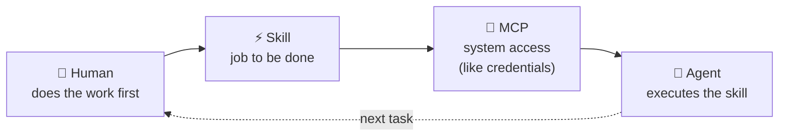
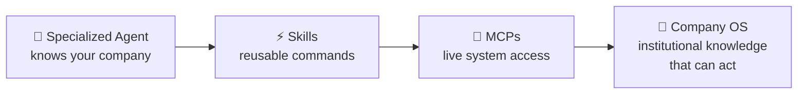

# The Appacadabra Chronicles: Preface

---

## Before We Begin: A Map of the Journey

There is a word that gets used often in the AI productivity space, and almost always incorrectly: *autonomous*.

As in: "I built an autonomous AI agent that runs my business." As in: "I set it loose and it figured everything out."

This series is not that story.

What I built over four months of nights and weekends, while holding down a full-time job, starting from a blank document and ending with a live Android app on the Play Store, serving users across multiple countries, was something more interesting and more difficult than autonomy. It was a **collaboration architecture**: a system where AI agents handled the execution of specialized work across every company department, and a human founder handled the strategic decisions, the validation, and the connective tissue that no AI can yet provide.

The company is **Appacadabra**. The product: a native Android app that lets users describe what they want, in plain language, and generates a fully functional mini-app for them, running locally on their device, powered by Google's Gemini API. Part app generator, part magic wand.

The constraint that shaped everything: **four months of nights and weekends**, working alone, with a full-time job running in parallel.

### The Central Question

Can a solo founder, working with AI as their staff, build a company (not just a product, but a company, with all the departments a real business requires) in four months?

I wanted to know if AI could serve as a Strategy Advisor who could run competitive analysis and stress-test positioning. A Branding Studio that could produce professional visual identity. A UX Department that could prototype every screen before a line of native code was written. An Engineering Team that could navigate a genuinely complex polyglot stack and manage localization across 17 languages. A QA Team that could automate the validation of an AI-generated product. A Finance Department that could model unit economics and design a sustainable pricing system. A Legal Counsel that could draft privacy policies grounded in the actual architecture. A Data Analyst who could interpret live Firebase metrics. A Release Manager who could navigate the Play Store compliance maze. A Marketing Department that could create and distribute content across X and LinkedIn. And an International Strategist who could map cultural and regulatory entry requirements for 10 markets.

The answer: yes. But not in the way the hype suggests.

### The Architecture That Made It Work

This series is not about prompting tricks or clever chatbot workflows. The key insight, the one that separates this from "I used AI to help me write stuff," is an architectural pattern that threads through every department:

**Agent > Skills > MCPs**

For each department I built, I also built a **specialized AI agent**: not a generic assistant, but one configured with Appacadabra's full context (our stack, our voice, our policies, our constraints). Each agent knows *this company*, not just this domain.

The pattern that made this work has three steps. First, I did each task myself — the way a new employee would, learning what needed to happen and in what order. Then I codified that process into a **Skill**: a reusable command tied to a specific job to be done. Where the skill needed access to live systems, I added an **MCP** (Model Context Protocol) — the equivalent of handing a team member their login credentials to Firebase, the Play Store, or our codebase. Once a skill existed with the right access, I handed it to a **specialized agent** to execute. That's how each agent was born: not designed top-down, but grown from real work I'd already done.

By the end of four months, eleven agents and twenty-eight executable commands held the institutional knowledge of the company in a form that could act on it.

Think of it like this: traditional companies spend years encoding their processes into wikis, runbooks, and SOPs that gather dust. I was encoding them into living agents that could execute them. Every task that passed through an agent, captured as a skill, and formalized as an MCP, made the system slightly more capable and slightly more specifically *Appacadabra*.

In the engineering community, this practice is beginning to be called **harness engineering**: the discipline of building the scaffolding that makes AI reliably capable in production contexts, as distinct from prompting (getting a good answer) or model training (improving the model itself). Harness engineering is what you're doing when you configure agents, codify skills, and formalize MCPs. It is the layer between a capable model and a functioning company.

This is the new model of the software company. Not a team of humans with AI assistants. Not autonomous AI with a human supervisor. A human CEO operating a constellation of specialized AI agents, each one deeply configured to serve the company's specific context.

One warning before you dive in, because every genuinely powerful technology earns one: **the harness is a means, not an end.** It is easy, especially for technically-minded founders, to get absorbed in building agents, configuring skills, and designing the architecture of a company instead of actually running one. The eleven departments in this series were built because the business needed them, in the order the business needed them. That sequence was not accidental. A Marketing agent built before you have a product to market is a distraction with good documentation. Build the infrastructure when the business demands it, not because the infrastructure is interesting.

### How to Read This Series

Each of the eleven articles that follow covers one department. They are designed to be read in sequence, because each department was built in sequence, and each one depends on decisions made in the ones before it. The strategic decisions in Part 1 constrain the branding decisions in Part 2. The QA harness in Part 5 keeps the Engineering output in Part 4 honest. The financial model in Part 6 shapes what Engineering actually builds. The legal groundwork in Part 7 informs the release strategy in Part 9. The marketing content in Part 10 feeds the international expansion in Part 11.

But if you have a specific domain you care about, here is the map:

---

**Part 1: Strategy** - The uncomfortable decision that set the scope for everything.
**Part 2: Branding** - AI gives you options. Taste gives you answers.
**Part 3: UX/Product** - Prototyping a mobile app in a browser before writing a single line of native code.
**Part 4: Engineering & Localization** - Three AI models, one stack. Why routing matters more than prompting.
**Part 5: QA** - How do you validate a system that generates different output every time?
**Part 6: Finance** - The math that has to work before a single user pays.
**Part 7: Legal** - Building a Privacy Policy you actually understand.
**Part 8: Analytics & DevOps** - Where AI breaks entirely. The honest chapter.
**Part 9: Release Management** - 47 configuration areas that have nothing to do with engineering.
**Part 10: Marketing** - The meta-insight: this series itself is the marketing strategy.
**Part 11: International Strategy** - Why distribution in India runs through YouTube, not app store search.

---

These eleven articles form a complete arc: a company assembled, department by department, from a blank document to a live product in production.

The conclusion that follows Part 11 steps outside the individual departments entirely and maps the full architecture that emerged. Eleven agents. Twenty-eight commands. A network of MCPs that connects them. The blueprint of what the company's operating system looks like from the outside, and what it means for the companies that come after.

*Start with Part 1. The first decision is the most consequential, and it gets made before a single line of code is written.*

---
